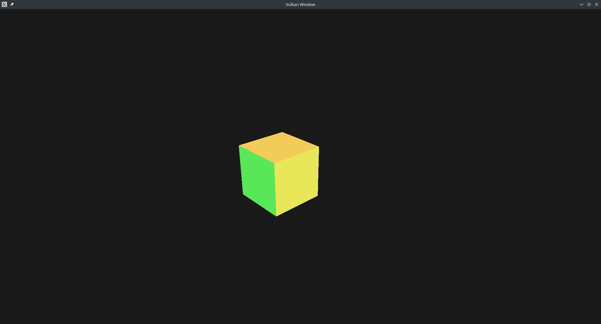

# Little Vulkan Engine
This project is an experimental game engine with Vulkan render. I use it for test ideas and new concepts about game engine development.

## Vulkan Game Engine Tutorial
I started this project following the Brendan Galea tutorials series [Vulkan Game Engine Tutorial](https://www.youtube.com/c/BrendanGalea/featured). He explains very well all concepts of each part about setting up a Game Engine with Vulkan. Also, he shows nice concepts about things you can do. I really recommend his tutorial and considered is the best vulkan tutorial so far.

## Third Party
All the dependencies are installed with [Conan](https://conan.io/) package manager with the [conanfile.txt](conanfile.txt)

| Name | Version |
---|---
| [spdlog]() | 1.8.2 | 
| [GLFW](https://www.glfw.org) | 3.3.2 |
| [Vulkan Headers](https://github.com/KhronosGroup/Vulkan-Headers) | 1.2.182 |  
| [Vulkan Loader](https://github.com/KhronosGroup/Vulkan-Loader) | 1.2.182 |  
| [Nlohmann json](https://github.com/nlohmann/json) | 3.9.1 |  
| [CLI11](https://github.com/CLIUtils/CLI11) | 1.9.1 |  
| [Vulkan® Memory Allocator](https://gpuopen.com/vulkan-memory-allocator) | 2.3.0 |  
| [Entt](https://github.com/skypjack/entt) | 3.8.0 |  

## Build
### Requirements
* CMake 3.18+
* Python 3+
* Conan 1.35.1+

### Conan
For install Conan and create the profile, there is the [Conan Getting Started](https://docs.conan.io/en/latest/getting_started.html).

### Linux
* GCC 11
```
mkdir build && cd build
conan install .. 
cmake .. -DCMAKE_BUILD_TYPE=Release
make
```

### Windows
* MSVC Compiler 16
```
mkdir build && cd build
conan install ..
cmake .. -DCMAKE_BUILD_TYPE=Release -G "Visual Studio 16"
cmake --build . --config Release 
```

### Samples
* Camera Movement
 
Example about how to implement a simple camera movement system with the keyboard input.


